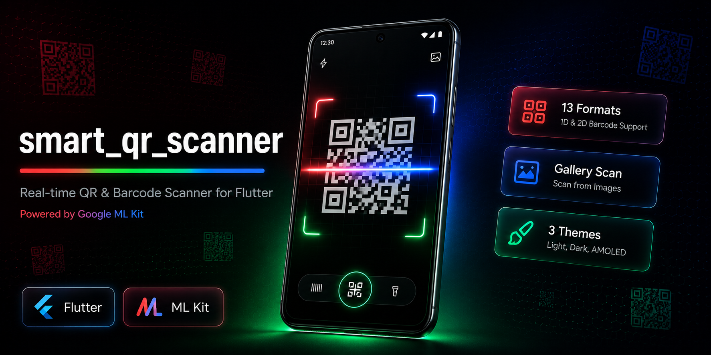

# smart_qr_scanner



[](https://pub.dev/packages/smart_qr_scanner) [](LICENSE) []()

A **production-ready** Flutter package for real-time QR code and barcode scanning powered by **Google ML Kit**. Drop in one widget, get a full-featured scanner with a modern animated UI, built-in QR generator, gallery scan, persistent history, favorites, CSV export, URL handling, haptic feedback, and a clean developer API.

---

## Features

**Scanning**
- **Real-time scanning** — high-FPS camera stream with ML Kit processing
- **Gallery scan** — pick any image from the device gallery and extract barcodes
- **13 barcode formats** — QR Code, Aztec, Codabar, Code 39/93/128, Data Matrix, EAN-8/13, ITF, PDF417, UPC-A/E
- **Pinch-to-zoom** — smooth gesture-based zoom, no slider UI clutter
- **Smooth camera switch** — front/back toggle with fade-in, no preview crash
- **Instant camera open** — pre-warm the controller before navigation so the preview is ready on landing

**QR Code Generator**
- **Built-in QR generator** — `QrGeneratorWidget` with no external rendering dependency
- **6 input types** — URL, plain text, WiFi credentials, email, phone number, vCard contact
- **Custom `QrPainter`** — renders the full QR matrix with correct 4-module quiet zone
- **Accent-coloured finder patterns** — eye regions use your accent color; data modules stay black
- **Save to gallery** — captures QR at 3× pixel ratio and saves via the `gal` package
- **Share QR image** — share as PNG with date/time subject line via `share_plus`
- **Copy data** — one-tap clipboard copy of the encoded string

**UI & Animations**
- **Modern animated loader** — glowing frame, sweep line, pulsing icon, animated dots
- **Animated scan line** — neon sweep with glow effect
- **Scan success animation** — elastic check-mark ring
- **Glassmorphism controls** — flash, flip, gallery buttons with blur backdrop
- **3 built-in themes** — Neon Cyan, Light, Minimal White + fully custom
- **Theme picker** — bottom sheet with animated selection rows
- **Granular UI control** — show/hide flash, gallery, flip, and menu buttons individually
- **GlobalKey API** — expose `showThemePicker()` from any external button (e.g. AppBar)
- **`DuplicateToastOverlay`** — animated in-app toast for duplicate scan feedback

**Data & Persistence**
- **Persistent history** — scan history saved to `SharedPreferences` via `StorageService`; survives app restarts
- **Favorites** — bookmark any scan result; persisted across sessions via `FavoritesService`
- **CSV export** — export full scan history as a `.csv` file and share it via `HistoryExporter`
- **JSON serialization** — `SmartScanResult.toJson()` / `fromJson()` for custom storage
- **Smart URL handler** — `SmartUrlHandler` launches URLs, email clients, phone dialer, SMS, and geo coordinates

**Feedback**
- **Haptic patterns per barcode type** — distinct vibration patterns for URL, email, phone, WiFi, etc.
- **Duplicate prevention** — configurable time-window deduplication

**Developer API**
- **Stream & Future APIs** — `onScan` callback, `scanEvents` stream, and `scanOnce()` Future
- **Lifecycle aware** — auto-pause on background, resume on foreground
- **Timeout handling** — configurable scan deadline with callback
- **Single & continuous modes** — stop after first hit or keep scanning
- **Permission handling** — built-in request flow with settings deep-link
- **Frame throttling** — configurable skip count to save CPU/battery

---

## Supported Formats

| Format      | Constant                   |
|-------------|----------------------------|
| QR Code     | `BarcodeFormat.qrCode`     |
| Aztec       | `BarcodeFormat.aztec`      |
| Codabar     | `BarcodeFormat.codabar`    |
| Code 39     | `BarcodeFormat.code39`     |
| Code 93     | `BarcodeFormat.code93`     |
| Code 128    | `BarcodeFormat.code128`    |
| Data Matrix | `BarcodeFormat.dataMatrix` |
| EAN-8       | `BarcodeFormat.ean8`       |
| EAN-13      | `BarcodeFormat.ean13`      |
| ITF         | `BarcodeFormat.itf`        |
| PDF417      | `BarcodeFormat.pdf417`     |
| UPC-A       | `BarcodeFormat.upca`       |
| UPC-E       | `BarcodeFormat.upce`       |

---

## Installation

```yaml
dependencies:
  smart_qr_scanner: ^1.3.0
```

```bash
flutter pub get
```

---

## Platform Setup

### Android

**`android/app/build.gradle`**
```gradle
android {
    defaultConfig {
        minSdkVersion 21   // ML Kit requires 21+
    }
}
```

**`android/app/src/main/AndroidManifest.xml`**
```xml
<manifest xmlns:android="http://schemas.android.com/apk/res/android"
    xmlns:tools="http://schemas.android.com/tools">

    <uses-permission android:name="android.permission.CAMERA" />
    <uses-permission android:name="android.permission.VIBRATE" />

    <!-- Gallery save: needed on Android 9 and below only -->
    <uses-permission android:name="android.permission.WRITE_EXTERNAL_STORAGE"
        android:maxSdkVersion="29"
        tools:replace="android:maxSdkVersion" />
    <uses-permission android:name="android.permission.READ_MEDIA_IMAGES" />

    <uses-feature android:name="android.hardware.camera" android:required="false" />
    <uses-feature android:name="android.hardware.camera.autofocus" android:required="false" />

    <application ...>
        <!-- inside <application> -->
        <meta-data
            android:name="com.google.mlkit.vision.DEPENDENCIES"
            android:value="barcode_ui" />
    </application>
</manifest>
```

### iOS

**`ios/Runner/Info.plist`**
```xml
<!-- Camera (required) -->
<key>NSCameraUsageDescription</key>
<string>Camera access is required to scan QR codes and barcodes.</string>

<!-- Gallery scan (required) -->
<key>NSPhotoLibraryUsageDescription</key>
<string>Required to pick images from your gallery for QR code scanning.</string>

<!-- Save generated QR to gallery -->
<key>NSPhotoLibraryAddUsageDescription</key>
<string>Required to save generated QR codes to your photo library.</string>

<!-- Required by the camera plugin -->
<key>NSMicrophoneUsageDescription</key>
<string>Microphone access is not used but required by the camera plugin.</string>
```

**`ios/Podfile`**
```ruby
platform :ios, '16.0'   # google_mlkit_barcode_scanning 0.13+ requires iOS 16+
```

---

## Quick Start

### Drop-in widget (simplest)

```dart
import 'package:smart_qr_scanner/smart_qr_scanner.dart';

class ScanPage extends StatefulWidget {
  const ScanPage({super.key});
  @override
  State<ScanPage> createState() => _ScanPageState();
}

class _ScanPageState extends State<ScanPage> {
  late final SmartQrScannerController _controller;

  @override
  void initState() {
    super.initState();
    _controller = SmartQrScannerController(
      config: const ScannerConfig(
        scanMode: ScanMode.single,
        enableVibration: true,
      ),
    );
    _controller.onScan = (result) {
      print('Scanned: ${result.rawValue} (${result.formatName})');
    };
    _controller.initialize();
  }

  @override
  void dispose() {
    _controller.dispose();
    super.dispose();
  }

  @override
  Widget build(BuildContext context) => SmartScannerWidget(
        controller: _controller,
        theme: ScannerTheme.light,
        hintText: 'Point at a QR code or barcode',
      );
}
```

### Instant camera open (recommended)

Pre-initialize the controller **before** pushing the scanner route so the camera warms up during the navigation transition and is ready the moment the screen lands:

```dart
void openScanner(BuildContext context) {
  final controller = SmartQrScannerController(
    config: const ScannerConfig(scanMode: ScanMode.single, enableVibration: true),
  );
  controller.initialize(); // fire immediately — overlaps with route animation

  Navigator.push(
    context,
    MaterialPageRoute(
      builder: (_) => ScannerPage(controller: controller),
    ),
  );
}

// In ScannerPage.initState():
// _controller = widget.controller;          // use pre-warmed controller
// _controller.onScan    = _onScan;          // wire callbacks
// _controller.onTimeout = _onTimeout;
// _controller.onError   = _onError;
// // do NOT call initialize() again
```

### Future-based single scan

```dart
final result = await _controller.scanOnce();
print(result.rawValue);
```

### Gallery scan

```dart
// Opens the device photo picker, scans the selected image,
// and fires onScan (or onError if no code is found).
await _controller.scanFromGallery();
```

---

## QR Generator

Drop `QrGeneratorWidget` anywhere to add a full-featured QR code creator:

```dart
QrGeneratorWidget(
  accentColor: const Color(0xFF00BCD4), // finder pattern & button color
  onGenerated: (data) => print('Generated: $data'),
)
```

Supported input types (selectable via chips inside the widget):

| Type    | Encoded format                     |
|---------|------------------------------------|
| URL     | Raw URL (auto-prefixes `https://`) |
| Text    | Plain string                       |
| WiFi    | `WIFI:T:WPA;S:ssid;P:pass;;`       |
| Email   | `mailto:address`                   |
| Phone   | `tel:number`                       |
| Contact | vCard 3.0 (`BEGIN:VCARD…END:VCARD`)|

The rendered QR code includes the mandatory 4-module quiet zone on all sides and passes standard scanner validation. Users can copy the data, save the QR image to the gallery, or share it as a PNG.

### Use `QrView` standalone

```dart
// Renders a scannable QR code for any string
QrView(
  data: 'https://flutter.dev',
  size: 250,
  eyeColor: Colors.teal,   // finder pattern accent
  dataColor: Colors.black, // data module color
  background: Colors.white,
)
```

### Use `QrPainter` in a CustomPaint

```dart
final qrImage = buildQrImage('https://flutter.dev');

CustomPaint(
  size: const Size(250, 250),
  painter: QrPainter(
    qrImage: qrImage!,
    eyeColor: Colors.teal,
    dataColor: Colors.black,
    background: Colors.white,
  ),
)
```

---

## URL Handler

`SmartUrlHandler` inspects a `SmartScanResult` and launches the appropriate system handler:

```dart
// Check if the result has a launchable action
if (SmartUrlHandler.canHandle(result)) {
  // Returns a label like 'Open URL', 'Send Email', 'Call', 'Send SMS', 'Open Map'
  final label = SmartUrlHandler.actionLabel(result);
  await SmartUrlHandler.launch(result);
}
```

| Barcode type      | Action                        |
|-------------------|-------------------------------|
| URL               | Opens in system browser       |
| Email             | Opens email composer          |
| Phone             | Opens phone dialer            |
| SMS               | Opens SMS composer            |
| Geo coordinates   | Opens maps app                |
| Raw `http/https`  | Opens in system browser       |

---

## Favorites

Persist favorite scan results across sessions:

```dart
final favService = FavoritesService();

// Check
final isFav = await favService.isFavorite(result.rawValue);

// Toggle (adds if not favorite, removes if favorite)
await favService.toggle(result.rawValue);

// Load all saved favorites
final favorites = await favService.loadAll();
```

### `FavoriteButton` widget

Drop-in animated bookmark button with a scale animation on toggle:

```dart
// In a list tile or AppBar action:
FavoriteButton.forValue(
  result.rawValue,
  activeColor: Colors.amber,
)
```

---

## Scan History

History is automatically persisted to `SharedPreferences` and restored on the next app launch.

```dart
// Access via the controller
final history = controller.history; // List<SmartScanResult>

// Clear
controller.clearHistory();
```

### Export as CSV

```dart
await HistoryExporter.exportCsv(controller.history);
// Generates a .csv file and opens the system share sheet
```

CSV columns: `Timestamp`, `Format`, `Type`, `Raw Value`, `Display Value`, `Confidence`

---

## JSON Serialization

`SmartScanResult` supports full round-trip JSON serialization for custom storage or API integration:

```dart
// Serialize
final json = result.toJson(); // Map<String, dynamic>

// Deserialize
final restored = SmartScanResult.fromJson(json);
```

All fields are preserved, including optional `Rect`, `List<Offset>`, and enum values.

---

## Duplicate Toast

Show an in-app toast when a duplicate barcode is scanned:

```dart
// Wrap your scanner screen in DuplicateToastOverlay:
DuplicateToastOverlay(
  child: SmartScannerWidget(controller: _controller, ...),
)

// Trigger from anywhere in the subtree:
DuplicateToastOverlay.show(context, message: 'Already scanned!');
```

The toast fades in and auto-dismisses after 2 seconds.

---

## Configuration

```dart
SmartQrScannerController(
  config: ScannerConfig(
    // Scan behaviour
    scanMode: ScanMode.single,           // or ScanMode.continuous
    cameraFacing: CameraFacing.back,     // or CameraFacing.front

    // Barcode formats (empty list = all 13 formats)
    formats: [BarcodeFormat.qrCode, BarcodeFormat.ean13],

    // Scan area (fraction of screen width/height)
    scanAreaWidthFactor: 0.75,
    scanAreaHeightFactor: 0.35,

    // Camera
    enableFlash: false,
    enableAutoFocus: true,

    // Feedback
    enableVibration: true,

    // Duplicate prevention
    preventDuplicates: true,
    duplicatePreventionWindow: Duration(seconds: 2),

    // Performance
    framesToSkip: 0,           // 0 = every frame; 2 = every 3rd frame

    // Timeout (null = no timeout)
    scanTimeout: Duration(seconds: 30),

    // History
    enableScanHistory: true,
    maxHistoryItems: 50,

    // Analytics
    onAnalyticsEvent: (value, format) => myAnalytics.track(value, format),
  ),
);
```

---

## Controller API

```dart
// Lifecycle
await controller.initialize();
await controller.dispose();

// Playback
controller.pause();
controller.resume();

// Camera
await controller.toggleFlash();
await controller.switchCamera();
await controller.setZoom(1.5);    // pinch-to-zoom also handled by widget

// Gallery
await controller.scanFromGallery();

// State
controller.isInitialized    // bool
controller.isPaused         // bool
controller.isFlashOn        // bool
controller.isSwitching      // bool — true while swapping cameras
controller.permissionStatus // CameraPermissionStatus
controller.history          // List<SmartScanResult>
controller.errorMessage     // String?
controller.minZoom          // double
controller.maxZoom          // double
controller.currentZoom      // double

// Callbacks
controller.onScan    = (SmartScanResult result) { ... };
controller.onRawScan = (List<SmartScanResult> all) { ... };
controller.onTimeout = () { ... };
controller.onError   = (String message) { ... };

// Streams
controller.scanEvents;     // Stream<SmartScanResult> — deduplicated
controller.rawScanEvents;  // Stream<List<SmartScanResult>> — every ML Kit batch

// Future API
final result = await controller.scanOnce();

// History
controller.clearHistory();
```

---

## Widget Parameters

```dart
SmartScannerWidget(
  controller: controller,

  // Theme (see Themes section below)
  theme: ScannerTheme.light,

  // Hint text shown below the scan area
  hintText: 'Align code within the frame',

  // Show/hide entire bottom control bar
  showControls: true,

  // Show/hide hint text
  showHint: true,

  // Show/hide individual bottom buttons
  showFlash: true,    // flash torch toggle
  showGallery: true,  // gallery image picker
  showFlip: true,     // front/back camera switch

  // Show/hide the built-in 3-dots theme picker button.
  // Set to false when you provide your own button via GlobalKey (see below).
  showMenu: true,

  // Called when user picks a theme from the bottom sheet
  onThemeChanged: (ScannerTheme t) => setState(() => _theme = t),

  // Override the default loading / error screens
  loadingWidget: MyLoadingScreen(),
  errorWidget:   MyErrorScreen(),
);
```

---

## Themes

### Built-in presets

```dart
ScannerTheme.neon     // Cyan glow, dark overlay (default)
ScannerTheme.light    // White corners, sky-blue scan line, soft overlay
ScannerTheme.minimal  // Pure white corners, minimal overlay
```

### Custom theme

```dart
ScannerTheme(
  overlayColor:              Color(0xAA000000),
  borderColor:               Color(0xFF00E5FF),
  borderRadius:              16.0,
  borderStrokeWidth:         3.5,
  cornerLength:              28.0,
  scanLineColor:             Color(0xFF00E5FF),
  scanLineHeight:            2.5,
  scanLineAnimationDuration: Duration(milliseconds: 1800),
  glassTintColor:            Color(0x22FFFFFF),
  glassBlurSigma:            12.0,
  buttonColor:               Color(0x44FFFFFF),
  buttonIconColor:           Colors.white,
  successColor:              Color(0xFF00E676),
  hintTextStyle:             TextStyle(color: Colors.white, fontSize: 14),
)

// Copy an existing preset and override only what you need:
ScannerTheme.neon.copyWith(borderColor: Colors.orange)
```

### Theme picker in a custom AppBar

```dart
final _scannerKey = GlobalKey<SmartScannerWidgetState>();

AppBar(
  actions: [
    IconButton(
      icon: const Icon(Icons.more_vert_rounded, color: Colors.white),
      onPressed: () => _scannerKey.currentState?.showThemePicker(),
    ),
  ],
)

SmartScannerWidget(
  key: _scannerKey,
  controller: _controller,
  showMenu: false,
  onThemeChanged: (t) => setState(() => _theme = t),
)
```

---

## Scan Result

```dart
SmartScanResult {
  String   rawValue;        // Raw barcode string
  String?  displayValue;    // Human-friendly value (formatted URL, phone, etc.)
  BarcodeFormat format;     // e.g. BarcodeFormat.qrCode
  BarcodeType   type;       // e.g. BarcodeType.url
  DateTime      timestamp;
  ScanResultType resultType; // success | duplicate | error | timeout
  Rect?          boundingBox;
  List<Offset>?  cornerPoints;
  double?        confidence;      // 0.0 – 1.0
  Map<String, dynamic> metadata;  // structured data: email, phone, url, wifi …

  // Helpers
  String formatName; // 'QR Code', 'EAN-13', …
  String typeName;   // 'URL', 'Email', …
  bool   isSuccess;

  // Serialization
  Map<String, dynamic> toJson();
  factory SmartScanResult.fromJson(Map<String, dynamic> json);
}
```

---

## Performance Tips

| Goal | Config / Approach |
|------|-------------------|
| Instant camera open | Pre-create controller and call `initialize()` before `Navigator.push` |
| Reduce CPU on slow devices | `framesToSkip: 2` |
| Faster cold start, lighter memory | `enableScanHistory: false` |
| Only need QR codes | `formats: [BarcodeFormat.qrCode]` |
| Prevent re-scan noise | `duplicatePreventionWindow: Duration(seconds: 3)` |
| Stop after first scan | `scanMode: ScanMode.single` |

---

## Troubleshooting

**Scanner shows "iOS Simulator" screen instead of camera**  
iOS Simulator has no physical camera hardware. `availableCameras()` returns an empty list, so the package shows a friendly informational screen instead of a red error. Run the app on a real iPhone or iPad to use live scanning. Gallery scan (`scanFromGallery()`) and QR generation still work in the Simulator.

**Camera permission denied on iOS**  
Add `NSCameraUsageDescription` to `ios/Runner/Info.plist`.

**Gallery picker crashes on iOS**  
Add `NSPhotoLibraryUsageDescription` to `ios/Runner/Info.plist`.

**Cannot save QR to gallery on iOS**  
Add `NSPhotoLibraryAddUsageDescription` to `ios/Runner/Info.plist`.

**ML Kit models not downloading on Android**  
Add `<meta-data android:name="com.google.mlkit.vision.DEPENDENCIES" android:value="barcode_ui"/>` inside `<application>` in `AndroidManifest.xml`.

**Manifest merger conflict for `WRITE_EXTERNAL_STORAGE`**  
Add `xmlns:tools` to the root `<manifest>` tag and `tools:replace="android:maxSdkVersion"` to the `<uses-permission>` element. See the Platform Setup section above.

**Black camera preview on open**  
Pre-warm the controller before `Navigator.push` (see _Instant camera open_ above). Always call `controller.dispose()` inside your widget's `dispose()`.

**Generated QR code not scannable**  
The QR code rendered by `QrPainter` includes the required 4-module quiet zone. Ensure the widget has a white background behind it and the `ClipRRect` (if any) does not clip the quiet zone or finder patterns.

**`buildPreview() on disposed CameraController` crash**  
Handled automatically via the `isSwitching` flag — the widget renders a black placeholder while the old controller is disposed.

**Slow detection**  
Increase `framesToSkip` or restrict `formats` to only what you need.

**No result from gallery image**  
The image must contain a clear, unobstructed barcode. Blurry, rotated, or very small codes may not be detected. `onError` is called with a descriptive message if nothing is found.

---

## License

```
MIT License — Copyright (c) 2026 Sanjay Sharma
```
